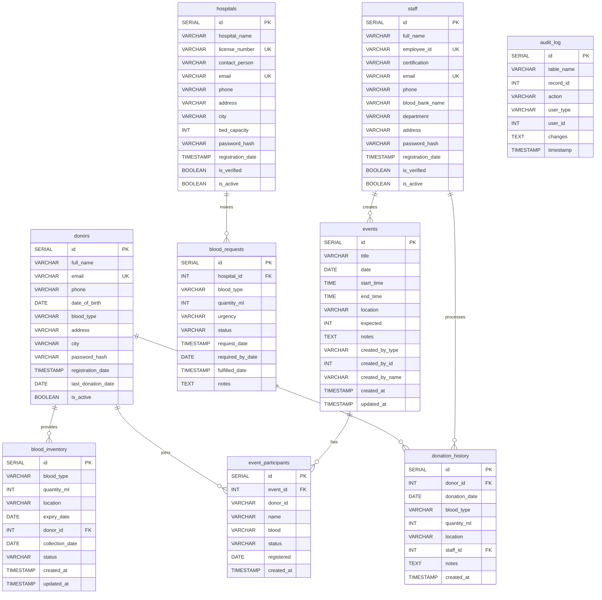

# Life Link Database - Entity Relationship Diagram

## ER Diagram

## Relationships Summary

### One-to-Many Relationships

1. **donors → donation_history**
   - One donor can have many donation records
   - Tracks complete donation history for each donor

2. **donors → blood_inventory**
   - One donor can contribute to many blood inventory units
   - Links blood supply to original donor

3. **donors → event_participants**
   - One donor can participate in many events
   - Tracks event attendance and registration

4. **hospitals → blood_requests**
   - One hospital can make many blood requests
   - Tracks all blood requests from each hospital

5. **staff → donation_history**
   - One staff member can process many donations
   - Records who handled each donation

6. **staff → events**
   - One staff member can create many events
   - Tracks event organizers

7. **events → event_participants**
   - One event can have many participants
   - Links donors to blood donation events

## Entity Descriptions

### Core Entities

- **donors**: Individual blood donors with personal information and blood type
- **hospitals**: Healthcare facilities that can request blood supplies
- **staff**: Blood bank employees who manage operations

### Operational Entities

- **blood_inventory**: Current blood supply with status and expiration tracking
- **blood_requests**: Hospital requests for blood with urgency levels
- **donation_history**: Complete record of all blood donations
- **events**: Blood donation drives and campaigns
- **event_participants**: Registrations for donation events

### System Entity

- **audit_log**: System-wide activity tracking for compliance and security

## Key Features

- **Referential Integrity**: Foreign keys maintain data consistency
- **Status Tracking**: Blood requests and inventory have status workflows
- **Audit Trail**: All major actions logged in audit_log table
- **Time Tracking**: Timestamps on critical operations
- **Soft Deletes**: is_active flags for user management
- **Index Optimization**: Strategic indexes on frequently queried columns
